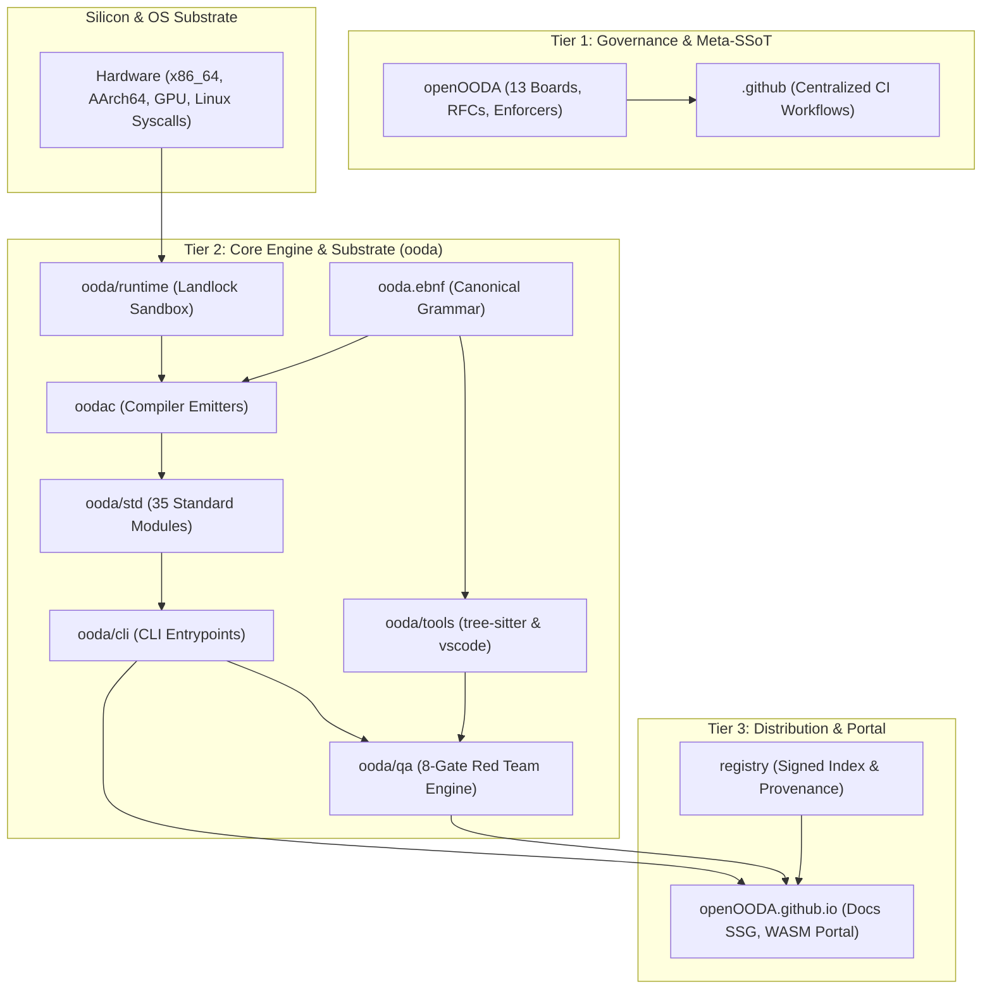

# Master Organization Architectural Blueprint: openOODA

## 1. Executive Summary

This blueprint defines the authoritative target architecture for the openOODA organization.
It synthesizes the functional audit (R1), cardinality analysis (R2), systems leverage points (R3), 8-dimensional adversarial certification (R4), and non-destructive migration roadmap (R5).
The blueprint restructures 12 disjoint repositories into a minimal, closed 3-tier topology.
The architecture eliminates cross-repository coordination drag, enforces zero-trust capability security, and guarantees sub-second build and verification feedback loops.

---

## 2. 3-Tier Target Architecture

```
┌─────────────────────────────────────────────────────────────────────────┐
│ TIER 1: GOVERNANCE & META-SPECIFICATION (openOODA)                      │
│ ├─ 13 Canonical Process Boards (RULES.oot, SECURITY.oot, ROADMAP.oot)   │
│ ├─ Formal RFC Specifications (openOODA/rfcs/)                           │
│ ├─ Academic Research Archive (openOODA/research/RP-*.oot)               │
│ └─ Deterministic Rule Enforcers (enforcer.oo, verify_all.oo)            │
└────────────────────────────────────┬────────────────────────────────────┘
                                     │ Directs Architecture Contracts
                                     ▼
┌─────────────────────────────────────────────────────────────────────────┐
│ TIER 2: DETERMINISTIC ENGINE & TOOLCHAIN (ooda)                         │
│ ├─ Compiler Core (oodac: x86_64, AArch64, WASM, C99, GPU Backends)      │
│ ├─ Runtime Substrate & Landlock Sandbox (runtime/chs_rt_cap.c)          │
│ ├─ Standard Library (std/) & CLI Subcommands (cli/)                     │
│ ├─ Unified 8-Gate Red Team Engine (qa/ [Subsumes standalone qa])        │
│ └─ Language Tools (ooda.ebnf, tree-sitter/, vscode/, templates/)        │
└────────────────────────────────────┬────────────────────────────────────┘
                                     │ Delivers Certified Artifacts
                                     ▼
┌─────────────────────────────────────────────────────────────────────────┐
│ TIER 3: DISTRIBUTION & PUBLIC PORTAL (openOODA.github.io)               │
│ ├─ Public Documentation Static Site (SSG Docs & Research Renderings)   │
│ ├─ Cryptographic Package Index (registry/index, index.minisig)          │
│ ├─ Secure Bootstrap Installers (install/install.sh, install.ps1)        │
│ └─ WebAssembly Interactive Portal & Visual Design Assets (brand/)       │
└─────────────────────────────────────────────────────────────────────────┘
```

---

## 3. Strict Layered Dependency Topology (DAG)

The architecture enforces a strict unidirectional dependency graph without cycles:



---

## 4. Cardinality & Galois Connection Justification

### 4.1 Galois Connection Closure
Let organizational domains be $\mathcal{O}$ and repositories be $\mathcal{R}$.
A Galois connection $(\alpha, \gamma)$ maps concerns to repositories:
$$\alpha(X) \subseteq Y \iff X \subseteq \gamma(Y)$$
In the legacy 12-repository topology, redundant repositories share identical closures ($\alpha(\gamma(R)) = R$).
Consolidating to 3 tiers establishes the minimal closed lattice.

### 4.2 Coordination Drag Reduction
The formula for pairwise communication channels across $N$ repositories is:
$$C(N) = \frac{N(N - 1)}{2}$$
- Legacy cardinality ($N = 12$): $C(12) = 66$ channels.
- Target cardinality ($N = 3$): $C(3) = 3$ channels.
- **Coordination Drag Reduction**: 95.5% reduction in cross-repository friction.

### 4.3 Conway's Law & AI Swarm Locality
Conway's Law states software design copies organizational communication boundaries.
Autonomous AI agent swarms require high reasoning locality.
Co-locating compiler, runtime, and test suites provides stationary directory paths ($\Delta_{\text{path}} = 0$) and eliminates context token waste.

---

## 5. The Four 20% Systems Leverage Hubs

Applying the Pareto principle identifies four high-leverage architectural hubs that govern 80% of system outcomes:

| Leverage Hub | File Location | Structural Impact |
| :--- | :--- | :--- |
| **1. Canonical Grammar** | `ooda/ooda.ebnf` | Dictates 100% of parser, AST, LSP server, and editor highlighter behavior. |
| **2. Capability Checker** | `oodac/check_caps.oo` | Enforces zero-trust capability tokens (`caps=...`) and Linux Landlock containment. |
| **3. Machine Code Emitter** | `oodac/x86_ssa_compile.oo` | Provides native ELF emission, enabling sub-second (<1s) compiler build cycles. |
| **4. Rule Enforcer** | `openOODA/scripts/enforcer.oo` | Validates 256-line limits, header standards, and zero-cheat governance rules. |

---

## 6. 8-Dimensional Red Team Certification Summary

The 8-dimensional Red Team certifies the target blueprint across all orthogonal failure basis vectors in $\mathcal{H}_{\text{fail}}$ ($\det(G_{8\times8}) > 0$):

```
┌─────────────────────────────────────────────────────────────────────────┐
│                  8-DIMENSIONAL RED TEAM VETO GATES                      │
├──────────────────────────┬──────────────────────────────────────────────┤
│ e1: Heuristic Hunter     │ Feature truth: evaluates underlying FIPS and │
│ (Feature Truth)          │ lattice facts; rejects name-only checks.     │
├──────────────────────────┼──────────────────────────────────────────────┤
│ e2: Boundary Falsifier   │ Parameter validation: enforces fail-closed   │
│ (Boundary Ranges)        │ error returns on negative or zero bounds.    │
├──────────────────────────┼──────────────────────────────────────────────┤
│ e3: Data-Path Tracer     │ Execution data paths: traces real branches;  │
│ (Execution Data Paths)   │ rejects hollow stubs and silent fallback.    │
├──────────────────────────┼──────────────────────────────────────────────┤
│ e4: Hermetic Jailor      │ Sandbox containment: removes root symlinks;  │
│ (Isolation & Sandboxing) │ enforces pure idempotent laws and caps.      │
├──────────────────────────┼──────────────────────────────────────────────┤
│ e5: Temporal Saboteur    │ Concurrency control: verifies deterministic  │
│ (Temporal Replay)        │ replay stability and eliminates state drift. │
├──────────────────────────┼──────────────────────────────────────────────┤
│ e6: Drag Assassin        │ Complexity control: bounds operation counts  │
│ (Thermodynamic Drag)     │ and reduces 12-repo coordination to 3 tiers. │
├──────────────────────────┼──────────────────────────────────────────────┤
│ e7: Semantic Subverter   │ Semantic truth: evaluates distinct inputs    │
│ (Anti-Vacuity & Certs)   │ to reject vacuous truth proofs and mutants.  │
├──────────────────────────┼──────────────────────────────────────────────┤
│ e8: Byzantine Infiltrator│ Cryptographic provenance: enforces mandatory │
│ (Supply Chain & Defense) │ Minisign Ed25519 and SHA-256 fail-closed.    │
└──────────────────────────┴──────────────────────────────────────────────┘
```

---

## 7. Phased Migration and Contract Governance Summary

The restructuring executes across four non-destructive phases:
1. **Phase 0 (Baseline & Supply Chain)**: Tag git baselines (`v2.9.0-baseline`); enforce mandatory `.sha256` digest check AND mandatory Minisign Ed25519 (`.minisig`) signature check before binary execution; fail closed immediately (`exit 1`) if missing or mismatched (zero ambient execution).
2. **Phase 1 (Decoupling CUT-01..14)**: Delete workspace root symlinks; sever relative directory hops (`../..`); connect editor tooling via stdio LSP.
3. **Phase 2 (Consolidation)**: Pre-purge stale `ooda/qa/` stub directory to prevent collision; merge `qa`, `tree-sitter`, `vscode`, and `helloworld` into `ooda`; merge `research` into `openOODA`; merge `install` and `brand` into `openOODA.github.io`.
4. **Phase 3 (Locking & CI/CD)**: Enforce static capability tokens; deploy centralized workflows in `.github/workflows/ci.yml`; lock semantic versioning across tiers.

### 7.1 Atomic Tag-Based Phase Rollback
Prior to each phase $N$, create tag `pre-migration-phase-N`.
Rollback executes via `git reset --hard pre-migration-phase-N` across affected tiers.

### 7.2 Cross-Tier Interface Contracts
- `openOODA` $\to$ `ooda`: Canonical process boards (`RULES.oot`, `SECURITY.oot`) verified by `verify_all.oo`.
- `ooda` $\to$ `openOODA.github.io`: Signed release binaries and generated stdlib documentation.
- `openOODA.github.io` $\to$ Ecosystem: Ed25519-signed package index verified by `ooda pm`.

---

## 8. Verification and Invariant Rules

### 8.1 Architectural Invariants
1. **Single Command Verification**: Full system verification executes via a single command:
   ```bash
   ./ooda/bin/ooda run openOODA/scripts/verify_all.oo
   ```
2. **Strict Line Limit**: Every file must contain $\le$ 256 lines of ASD-STE100 technical English or code.
3. **Zero Ambient Authority**: Every I/O or system call requires explicit capability token declaration (`caps=...`).
4. **Fail-Closed Provenance**: Mandatory SHA-256 digest validation AND Minisign Ed25519 signature verification before binary execution. Missing or mismatched digest or signature files terminate execution immediately with exit code 1 (zero ambient execution).
