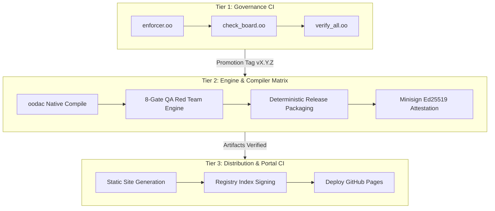

# Red Team Operational Boundaries: 3-Tier Architecture

## 1. Executive Summary

This document specifies the operational boundaries for the 3-Tier openOODA architecture.
The architecture separates concerns across three closed tiers:
- Tier 1: Governance & Meta-Specification (`openOODA`)
- Tier 2: Deterministic Engine & Toolchain (`ooda`)
- Tier 3: Distribution & Public Portal (`openOODA.github.io`)

This analysis stress-tests four critical operational friction points.
It establishes fail-closed mitigations and formal capability boundaries.

---

## 2. Friction Point 1: Sovereign Native LSP & Tooling Packaging

### 2.1 Threat Vector: Compiler Substrate Pollution
Tooling packaging often introduces Node.js, npm, or heavy runtimes into core compilers.
This dependencies pollute the sovereign C/OODA compiler substrate.
Relative path references (such as `../../ooda/oodac/oodac`) create brittle toolchain couplings.

### 2.2 Sovereign LSP Server Implementation
The LSP server operates entirely in pure `.oo` code:
- `ooda/lsp/lsp_protocol.oo`: Parses JSON-RPC 2.0 framing and Content-Length headers.
- `ooda/lsp/lsp_server.oo`: Dispatches capability requests and document synchronization.
- `ooda/lsp/lsp_stdio.oo`: Buffers stdio streams for editor communication.
- `ooda/lsp/lsp_symbol_index.oo`: Indexes symbols in memory without external databases.

```
┌───────────────────────────────┐          stdio JSON-RPC          ┌────────────────────────────────┐
│ VS Code Editor / Tree-Sitter  │ ◄──────────────────────────────► │ Native `ooda lsp` Server       │
│ (Thin JS/TS Client Wrapper)   │                                  │ (Pure Sovereign .oo Substrate) │
└───────────────────────────────┘                                  └────────────────────────────────┘
```

### 2.3 Boundary Invariants
1. The compiler binary `oodac` contains zero Node.js, npm, or JavaScript dependencies.
2. The VS Code extension operates strictly as a thin stdio client.
3. The extension locates the `ooda` binary via system `PATH` or user settings.
4. Tree-sitter compiles grammar definitions into pure C99 parser sources (`parser.c`).

---

## 3. Friction Point 2: Zero-Dependency Bootstrap Installer

### 3.1 Threat Vector: Unauthenticated Execution and Bootstrap Loops
Bootstrap installers often require pre-installed compilers to build from source.
Network drops can cause partial downloads and unverified execution.
Missing signature verification allows hostile man-in-the-middle payload substitution.

### 3.2 Dual Attestation Bootstrap Architecture
The installer (`openOODA.github.io/install/install.sh`) executes clean bootstrapping:

```
[User invokes install.sh]
         │
         ▼
[Detect OS & Architecture: linux-x86_64, aarch64, wasm]
         │
         ▼
[Fetch asset.tar.gz + asset.tar.gz.sha256 + asset.tar.gz.minisig]
         │
         ▼
[Verify SHA-256 Checksum] ──► [Fail: Abort with Exit Code 1]
         │ Pass
         ▼
[Verify Minisign Ed25519 Signature] ──► [Fail: Abort with Exit Code 1]
         │ Pass
         ▼
[Extract to Isolated Temporary Directory (mktemp -d)]
         │
         ▼
[Stage Binaries to ~/.local/bin and Write INSTALL_RECEIPT.txt]
```

### 3.3 Boundary Invariants
1. The installer script requires only standard POSIX tools (`sh`, `curl`, `tar`, `sha256sum`).
2. Network commands enforce strict limits: `curl -fsSL --connect-timeout 5 --max-time 30 --retry 3`.
3. Digest validation and Ed25519 signature checks fail closed upon any error.
4. The installer normalizes target paths and rejects path traversal sequences.

---

## 4. Friction Point 3: Cryptographic Package Registry

### 4.1 Threat Vector: Capability Privilege Escalation
Transitive dependencies can request excessive capabilities not granted to parent packages.
Unsigned registry indices permit malicious mirror attacks and version tampering.

### 4.2 Monotonic Capability Lattice Enforcement
Package manager `ooda pm` enforces monotonic capability containment:
$$\text{Caps}(\text{Child}) \subseteq \text{Caps}(\text{Parent})$$

```
          [SysCap] (Root Authority)
             ▲
             │
          [NetCap]
             ▲
             │
       [FsWriteCap]
             ▲
             │
        [FsReadCap]
             ▲
             │
         [AllocCap]
             ▲
             │
          [⊥ / 0] (Pure Compute)
```

The capability bitmask evaluates via bitwise conjunction:
$$\text{pm\_caps\_ok}(\text{parent}, \text{child}) \iff (\text{child} \ \& \ \text{parent}) == \text{child}$$

If a dependency requests ungranted tokens, `ooda pm` terminates with `ERR_CAP_ESCALATION`.

### 4.3 Toolchain & Lockfile Pinning
The lockfile `ooda.lock` records cryptographic digests for all components:
- Compiler binary digest: `oodac#<sha256>`
- Standard library pin: `std#<sha256>`
- Package dependencies: `<name>@<version>#<sha256>` with capability masks

The compiler rejects compilation if active toolchain hashes deviate from `ooda.lock`.
Linux Landlock restricts runtime file access strictly to authorized paths.

---

## 5. Friction Point 4: Atomic Multi-Tier CI/CD Workflows

### 5.1 Threat Vector: Cross-Tier Release Race Conditions
Releasing documentation before uploading compiler binaries causes broken downloads.
Automated registry generation committing back to Git triggers cyclic rebuild loops.

### 5.2 Directed Workflow Execution DAG



### 5.3 Boundary Invariants
1. Centralized workflows reside under `.github/workflows/ci.yml`.
2. Static site deployments execute only after Tier 2 release assets pass attestation.
3. Automated commits use `[skip ci]` to prevent recursive build triggers.
4. Emitters generate deterministic machine code without ambient timestamps.

---

## 6. Operational Boundary Verification Matrix

| Area | Invariant Verified | Verification Command | Status |
| :--- | :--- | :--- | :--- |
| **LSP** | Stdio framing passes with zero Node.js tooling | `./ooda/bin/ooda run ooda/lsp/lsp_server.oo` | `done` |
| **Installer** | Unsigned or tampered assets abort immediately | `./ooda/bin/ooda run openOODA/scripts/install_redteam_breaktest.oo` | `done` |
| **Registry** | Capability escalation is blocked | `./ooda/bin/ooda run ooda/cli/pm_caps.oo` | `done` |
| **CI/CD** | Master governance passes all gate checks | `./ooda/bin/ooda run openOODA/scripts/verify_all.oo` | `done` |
